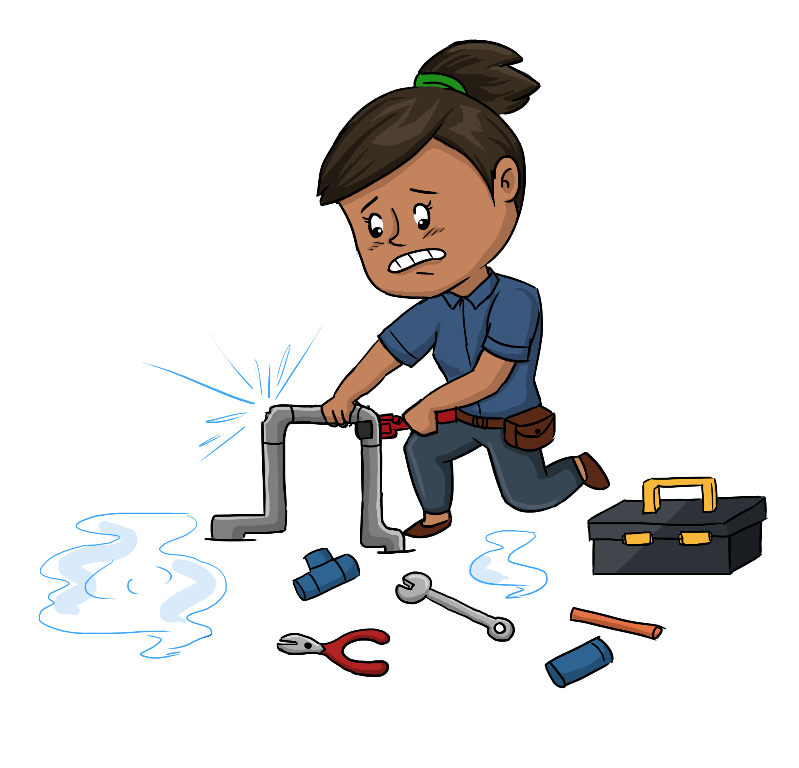
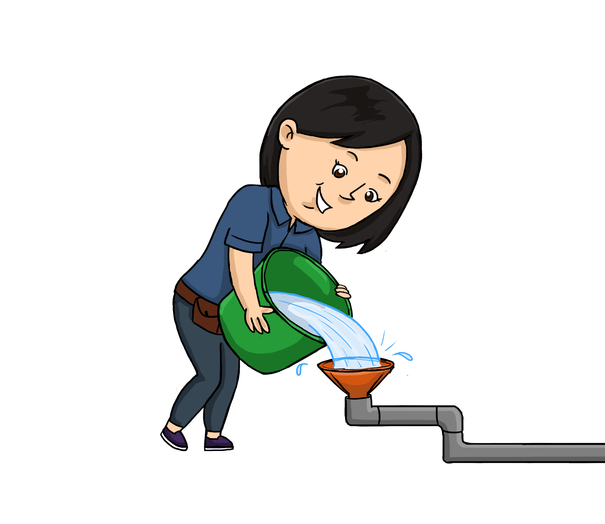
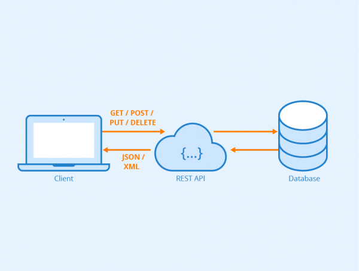
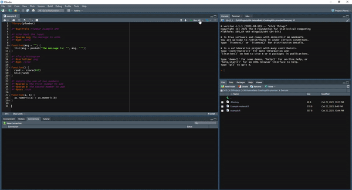
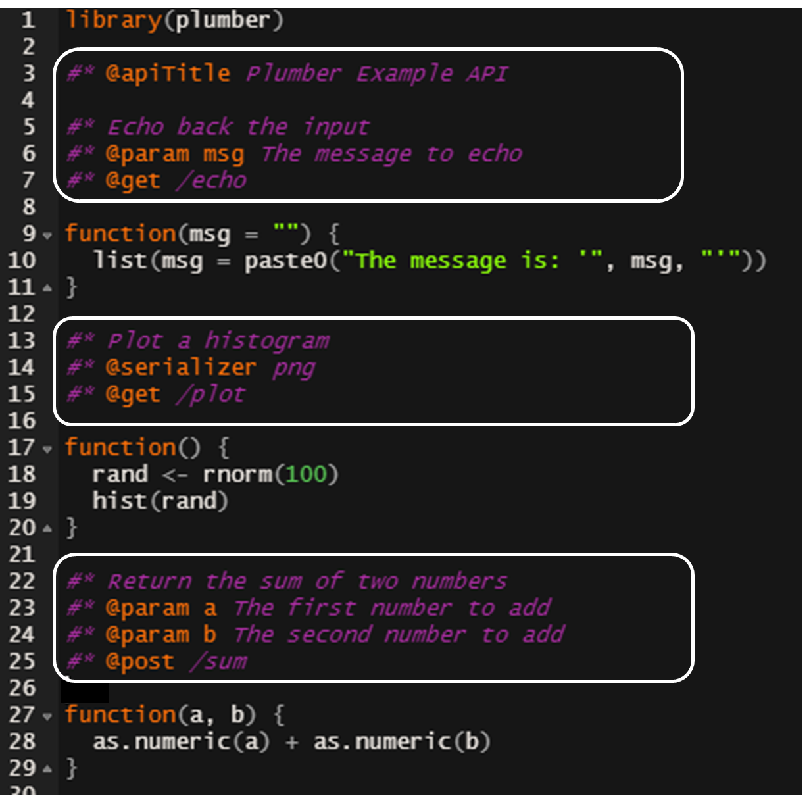

```{r setup, include=FALSE}

# figures formatting setup
options(htmltools.dir.version = FALSE)
library(knitr)

knitr::opts_chunk$set(eval = FALSE)

library(plumber)

```

# Table of contents

1. [Quick intro into APIs](#intro)
2. [The Plumber package](#plumber)
  + [Annotations](#annotations)
  + [Filters](#filters)
  + [Parsers and serializers](#parsers and serializers)
  + [Methods and parameters](#methods and parameters)
3. [Deploying Plumber APIs](#deploying)

<br> 
<div align="center">




</div>

`Disclaimer` Order of pictures does not necessarily represent Plumber package creators' views


---
name: intro

#Quick intro into APIs

.pull-left[
##What are APIs?

API (Application Programming Interface) is a set of rules on how computers or applications communicate with one another.

**Metaphor:** Electric sockets are interfaces to access a service: a socket is an intermediary between electricity and a vacuum cleaner.<sup>1</sup>

**Everyday APIs:**
- web browsers 
- login with Google/Twitter/Facebook
- travel booking (e.g. Skyscanner)
- every time we see a Google map on a web site

]

--

.pull-right[
##How do (web) APIs work?

1. A **client** initiates an API call (**request**) to retrieve information 
2. API "talks" to a web server
3. A **server** sends a **response** with the requested information
4. API transfers the data to the client

<div align="left">

</div>
`Credit` Seobility
]

.footnote[<sup>1</sup> This example was modified from [David Berlind's series on APIs](https://www.programmableweb.com/api-university/what-are-apis-and-how-do-they-work)]

---
#Quick intro into APIs

##Why do we need them?

Electric sockets are useful because:
- any device can outsource its electrical requirements and always get the same output
- devices can easily be moved around
- devices do not care about the changes behind the socket as long as the output remains the same
- electricity service does not care about the device

--

APIs are useful because:
- code/data can be easily shared and re/used
- information can be shared across multiple clients and will not depend on the programming language

---
name: plumber

#The Plumber package

.pull-left[

The `plumber` R package allows users to expose existing R code as a web service available to others by using simple "annotations".

How to work with `plumber`:
0. Write the code you want to share
1. Annotate (**decorate**) your code with special comments (#*) and tags (@)
2. Run (**plumb**) the API
3. (Deploy your API)

<br>
<div align="justify">

</div>


]

.pull-right[

<br> 
<div align="center">

</div>
`Credit` Windows 95

]

---
#The Plumber package

<br> 
<div align="center">

</div>


---
name: annotations

#Plumber annotations

.pull-left[

<div align="center">

</div>

]

.pull-right[

Annotations are specially-structured comments used to create an API. A full annotation line starts with `#*`, followed by the annotation keyword `@`.


**Types of annotations:**

- Global annotations: describe the API (e.g. `@apiTitle`, `@apiDescription`)
- Filter annotation: defines a filter (`@filter [name]`)
- Endpoint annotation:
  - `@parser [parser name]` determines how to parse the request body 
  - method (e.g.`@get [path]`) responds to incoming requests that match the defined method
  - `@param [name]` define API inputs
  - `@serializer [serializer name]` determines the format of the response

]


---
name: filters

#Filters

Filters are used to handle/modify incoming requests. Typically, a request will pass every specified filter before going to the endpoint. Common uses are collecting information about incoming requests and authentication.

--

.pull-left[

**Request logger:**

``` {r}
#* @filter logger
function(req, res){
  cat(as.character(Sys.time()), "-",
      req$REQUEST_METHOD, req$PATH_INFO, "-",
      req$HTTP_USER_AGENT, "@", req$REMOTE_ADDR, "\n", append=TRUE, file="api_logs.txt")
  plumber::forward()
}
```


Log file:
```{r, eval=TRUE, echo=FALSE, fig.width=5}
v <- scan("./example/api_logs.txt", what = " ", sep = "\n")
paste0("number of entries: ",length(v))
v[1:3]
```
]


.pull-right[

**Authentication:**

```{r }
#* @filter checkAuth
function(req, res){
  if (is.null(req$username)){
    res$status <- 401 # Unauthorized
    return(list(error="Authentication required"))
  } else {
    plumber::forward()
  }
}
```

`{"error":["Authentication required"]}`

]

---
name: parsers and serializers

#Parsers and serializers

Parsers will determine how API "reads" the request and serializer will determine the format that API will use to respond to the request. Default parser and serializer is **JSON** (JavaScript Object Notation).

--

.pull-left[

```{r, eval=TRUE}
registered_parsers()

```
```{r, eval=TRUE}
registered_serializers()

```

]


.pull-right[

<div align="right">

</div>


]

---
name: methods and parameters

#Methods & parameters

.pull-left[

There are conventions on which endpoint **method** to use for particular types of requests.<sup>2</sup> These are some of the most common uses:

- `@get`: **Read** (retrieve) a resource
- `@post`: **Create** new resources
- `@put`: **Update** a resource
- `@patch`: **Modify** a resource
- `@delete`: **Delete** a resource

]

.pull-right[

<br>
<div align="right">

</div>

`Credit` Pixar

]


---
#Methods & parameters

.pull-left[

There are conventions on which endpoint **method** to use for particular types of requests.<sup>2</sup> These are some of the most common uses:

- `@get`: **Read** (retrieve) a resource
- `@post`: **Create** new resources
- `@put`: **Update** a resource
- `@patch`: **Modify** a resource
- `@delete`: **Delete** a resource

**Parameters** define API inputs<sup>3</sup> which will enable sending user data to the API endpoint.

Note: unless otherwise instructed, all parameters will be passed as character strings.


.footnote[<sup>2</sup> [See more on using HTTP methods for RESTful services](https://www.restapitutorial.com/lessons/httpmethods.html)<br> <sup>3</sup> [See more on `@get` and `@post` methods and parameters](https://stackoverflow.com/questions/504947/when-should-i-use-get-or-post-method-whats-the-difference-between-them)]

]

.pull-right[

<div align="right">

</div>

]

---
name: deploying

#Deploying APIs

Running the API from R means you are hosting it on your laptop/PC. There are several reasons why this might be a bad idea:

1. IP addresses are often dynamic and can change over time, meaning that clients will no longer be able to interact with the API
2. Firewalls might block incoming traffic
3. If Plumber process crashes or machine gets rebooted, API will have to be manually restarted
4. Clients need to specify a port number manually
5. One R process will have to be continuously running
6. Serving public requests can be a security hazard

--

There are several [options](https://www.rplumber.io/articles/hosting.html) for hosting Plumber APIs. From R, the simplest way might be to use the `plumberDeploy` [package](https://github.com/meztez/plumberDeploy) to deploy the API to DigitalOcean.

```{r}
mydrop <- plumberDeploy::do_provision #takes about 10 minutes
# before deployment packages that API relies upon need to be installed on the DigitalOcean
plumberDeploy::do_deploy_api(id, "date", "./api/", 8000, docs = TRUE)
```

---
name: resources

#Where to go next?

.pull-left[

Some additional resources:

- [Plumber documentation](https://www.rplumber.io/index.html) 
- [API examples with Plumber](https://github.com/sol-eng/plumberExamples) 
- [Plumber cheatsheat](https://github.com/rstudio/cheatsheets/blob/master/plumber.pdf)

More advanced topics & examples:
1. Security: see [Plumber  documentation](https://www.rplumber.io/articles/security.html)
2. [Plumber tips](https://gabrielcp.medium.com/making-apis-with-r-plumber-examples-and-tips-a36efdffc3fd)
3. [Plumbing machine learning models](https://shirinsplayground.netlify.app/2018/01/plumber/)


]

.pull-right[

<br>
<div align="center">

</div>


]

---
class: inverse, center, middle

Thanks for tuning in!

Coming next: Plumber tutorial with Katalin Bayer 
